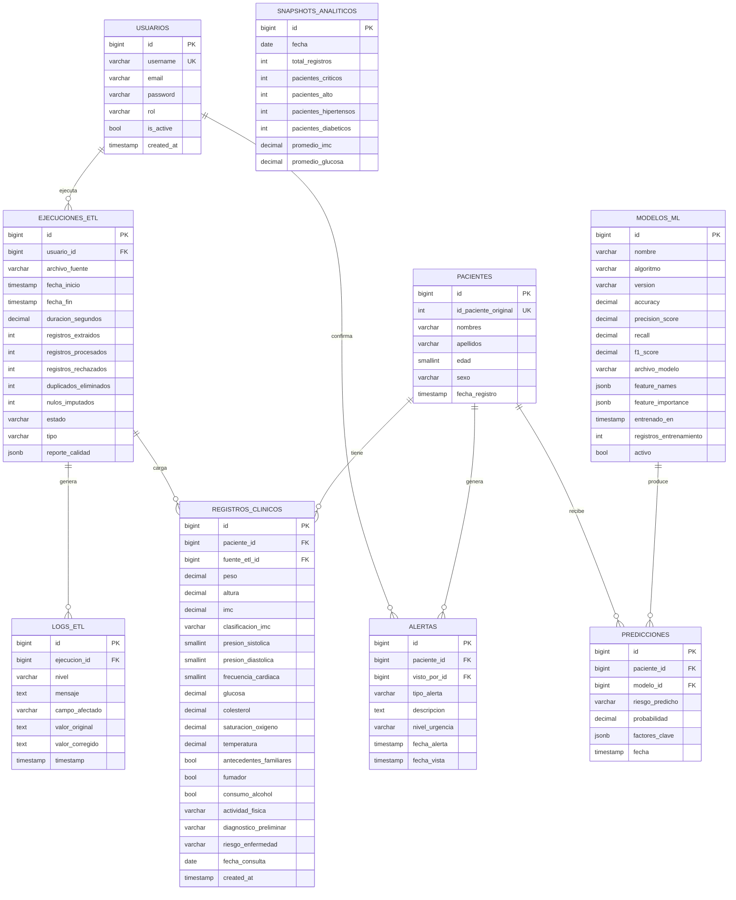

# HealthShield AI — Diagrama ERD

## Índices de rendimiento

| Índice | Tabla | Campo(s) | Propósito |
|---|---|---|---|
| idx_registro_riesgo | registros_clinicos | riesgo_enfermedad | Filtros por riesgo |
| idx_registro_paciente | registros_clinicos | paciente_id | Joins paciente-registro |
| idx_registro_fecha | registros_clinicos | fecha_consulta DESC | Tendencias temporales |
| idx_alerta_urgencia | alertas | nivel_urgencia, fecha DESC | Dashboard alertas |
| idx_alerta_vista | alertas | fecha_vista WHERE NULL | Alertas pendientes |
| idx_etl_estado | ejecuciones_etl | estado, fecha DESC | Historial ETL |
| idx_prediccion_paciente | predicciones | paciente_id | Historial predicciones |
| idx_modelo_activo | modelos_ml | activo WHERE TRUE | Modelo activo |

## Reglas de negocio implementadas

- `riesgo_enfermedad` ∈ {Bajo, Medio, Alto, Crítico}
- `sexo` ∈ {M, F}
- `rol` ∈ {administrador, medico, analista}
- `nivel_urgencia` ∈ {baja, media, alta, critica}
- `estado` ETL ∈ {en_proceso, completado, fallido}
- `algoritmo` ML ∈ {random_forest, logistic_regression, decision_tree}
